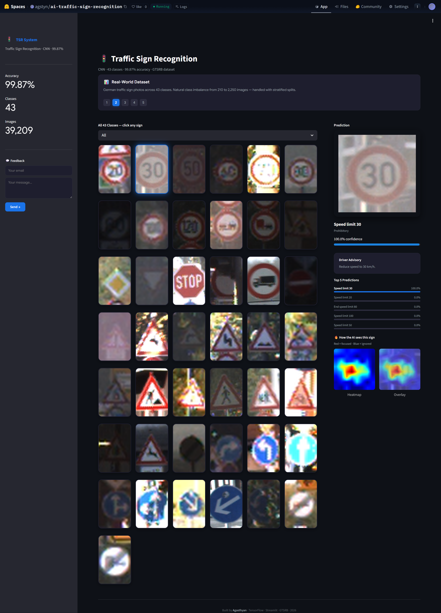
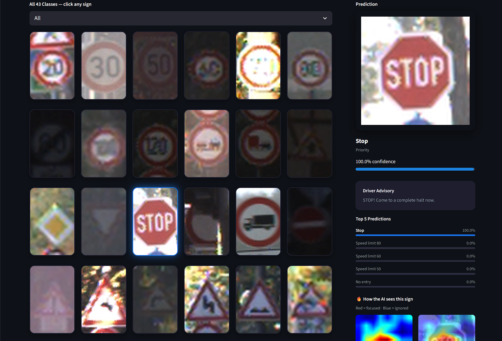
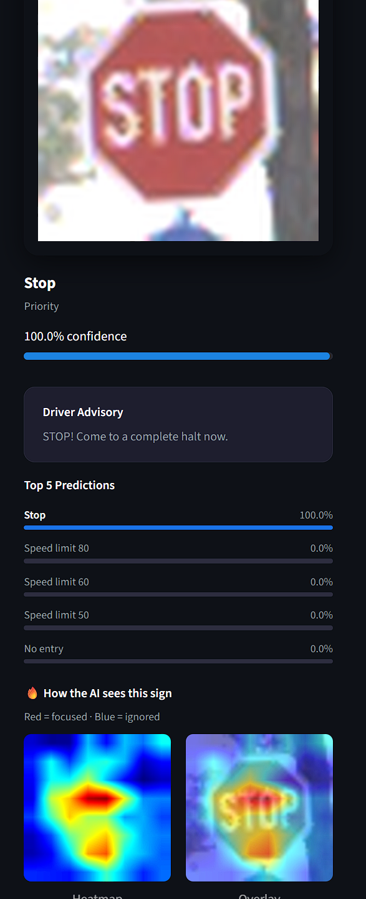

````md id="jlwm162"
# 🚦 AI Traffic Sign Recognition System

AI-powered traffic sign recognition system using Convolutional Neural Networks (CNN), Grad-CAM explainability, TensorFlow, and Streamlit.

---

## ✨ Features

- 43 traffic sign classes
- CNN-based image classification
- Grad-CAM explainability heatmaps
- Interactive Streamlit dashboard
- Confidence visualization
- Category filtering
- Real-world GTSRB dataset
- Modern dark UI

---

## 🧠 Tech Stack

- Python
- TensorFlow / Keras
- Streamlit
- OpenCV
- NumPy
- Pillow

---

## 📊 Model Performance

- Validation Accuracy: **99.87%**
- Dataset: German Traffic Sign Recognition Benchmark (GTSRB)
- 43 classes
- 39,209 training images

---

## 🔥 Grad-CAM Explainability

The system visualizes which regions of the image the CNN focuses on during prediction using Grad-CAM heatmaps.

---

## 🚀 Run Locally

```bash
git clone https://github.com/agstyn/ai-traffic-sign-recognition.git

cd ai-traffic-sign-recognition

pip install -r requirements.txt

streamlit run app.py
````

---

## 📁 Project Structure

```text
ai-traffic-sign-recognition/
│
├── app.py
├── requirements.txt
├── models/
├── src/
│   ├── constants.py
│   ├── gradcam.py
│   ├── image_utils.py
│   ├── model_utils.py
│   ├── slideshow.py
│   └── ui_components.py
```
## Live Demo

Hugging Face:
https://huggingface.co/spaces/agstyn/ai-traffic-sign-recognition

GitHub:
https://github.com/agstyn/ai-traffic-sign-recognition

---

## 📸 Screenshots

### Homepage

<p align="center">
  
</p>

---

### Interactive Prediction Dashboard

<p align="center">
  
</p>

---

### AI Prediction Output

<p align="center">
  
</p>

---

### Grad-CAM Explainability

<p align="center">
  
</p>


## 👨‍💻 Author

Agasthyan
